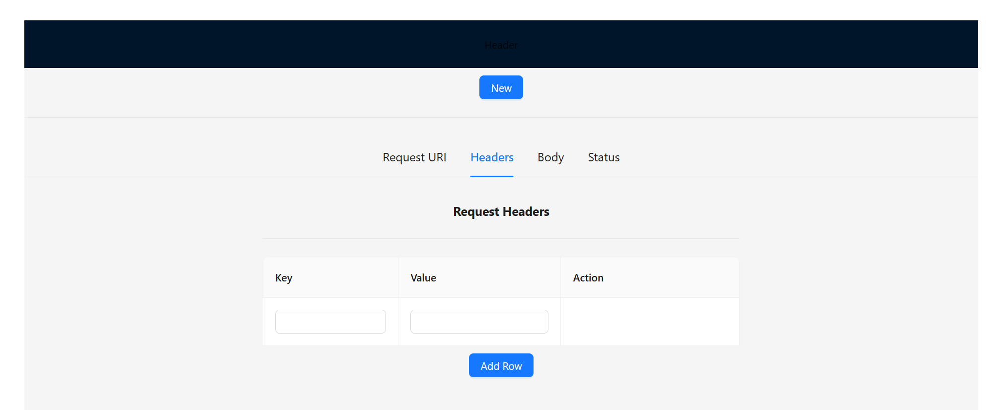
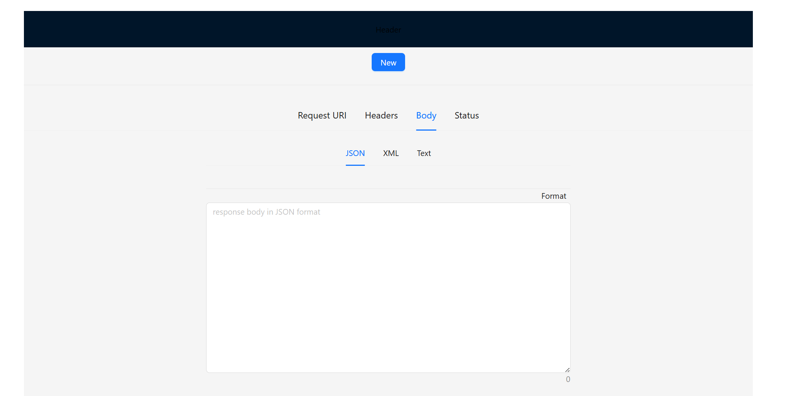
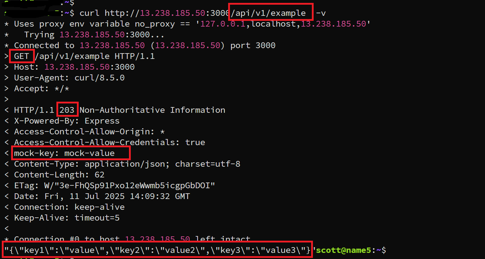

# APIMock
一个简易的restful API mock工具, 用于前后端的接口测试. 

feature support
| 功能   |  support   |
|--------|:----------:|
| 请求方法(GET/POST)       |  support           |
| request path       |  support          |
| http header       |    support        |
| response body(json,xml,text)       |    support        |
|  http status      |   support         |


测试demo:
```
http://13.239.238.244:3000/index.html
```
首页:






example：
```
mock:
GET /api/v1/example
header:
mock-key: mock-value
response:
{
    "key1": "value1",
    "key2": "value2",
    "key3": "value3",
}
```

